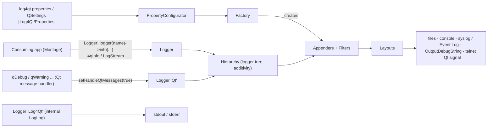

# AGENTS.md — Log4Qt (DisplayNote fork)

## Project snapshot

- **What it is:** DisplayNote's fork of [MEONMedical/Log4Qt](https://github.com/MEONMedical/Log4Qt),
  a C++ port of Apache log4j on top of Qt: loggers, levels, appenders (sinks), layouts
  (formatters), filters and a `log4qt.properties` / `QSettings` configurator. It is a library
  only — no executable ships from this repo.
- **Who uses it:** DisplayNote apps (Montage) link the conan package `log4qt` built by
  `azure-pipelines.yml` (`src/conanfile.py`). The consuming app decides which appenders run and
  where log files go; this repo ships no default log configuration.
- **Stack:** C++17, Qt **6.8** minimum (hard `#error` in `src/log4qt/log4qt.h`; DisplayNote builds
  against Qt 6.8.8 LTS), qmake (`log4qt.pro`, used by DisplayNote CI), CMake and qbs (upstream,
  still maintained here). Library version `1.7.0` (`build.pri`, `CMakeLists.txt`); DisplayNote git
  tags are `2.0.0`, `2.1.0`. Platforms built by CI: Windows x86_64, macOS x86_64 + arm64, iOS
  arm64, Android arm64-v8a / armeabi-v7a / x86_64.

## Security

- NEVER suggest hardcoded credentials, API keys, or connection strings
- NEVER generate code that logs PII or sensitive data
- Flag any code that introduces new external dependencies
- Prefer established authentication patterns (OAuth2, JWT) over custom implementations
- Do not generate SQL without parameterised queries
- Flag any configuration changes that affect network exposure or access controls
- NEVER read raw log files or paste log content into a prompt — sanitise with `dn_logscrub` first (`/log-sanitise <file>`) and work only from the `.scrubbed` copy (AI Security Roadmap 4.7)
- This repo is a logging framework: treat any change to an appender, layout or the internal
  `Log4Qt` (LogLog) logger as a change to what every consuming app writes to disk, console or the
  network. `TelnetAppender` (compiled into the DisplayNote qmake build) opens a TCP listener —
  flag any change to it. See [docs/runbooks/debugging-with-ai.md](docs/runbooks/debugging-with-ai.md).

## Repository map

```text
.
├── src/
│   ├── conanfile.py          DisplayNote conan recipe (packages the CI build output)
│   ├── src.pro               qmake subdirs → log4qt/
│   └── log4qt/               the library: loggers, appenders, layouts, configurators
│       ├── helpers/          configurator/factory/properties/pattern formatter/LogError internals
│       ├── spi/              Filter base class
│       └── varia/            filters, DebugAppender, ListAppender, NullAppender
├── include/log4qt/           CamelCase forwarding headers (`#include <log4qt/Logger>`)
├── tests/                    Qt Test suites: log4qttest, binaryloggertest, dailyfileappendertest, filewatcher
├── examples/                 basic (programmatic setup), propertyconfigurator (properties file)
├── cmake/                    CMake package config templates
├── doc/                      upstream Doxygen config (`Doxyfile.in`) — upstream material, do not edit
├── docs/                     AI-agent docs (architecture, modules, runbooks, glossary)
├── log4qt.pro, build.pri, g++.pri   qmake entry + version/defines + gcc warnings
├── CMakeLists.txt            CMake entry (tests + examples always added)
├── log4qt.qbs, log4qtlib.qbs, others.qbs   upstream qbs build
├── azure-pipelines.yml       DisplayNote CI (qt-conan-ci templates, tag 2.4.0)
├── .travis.yml, appveyor.yml upstream CI configs (Qt 5, not used by DisplayNote)
└── Readme.md, ChangeLog.md   upstream README (+ DisplayNote macOS section) and changelog
```

## Run / build / test / lint

Full steps: [docs/runbooks/local-setup.md](docs/runbooks/local-setup.md) and
[docs/runbooks/testing.md](docs/runbooks/testing.md). Short version:

```bash
# Library only, the way DisplayNote CI builds it (qmake, Qt 6.8 on PATH)
mkdir -p ../log4qt-build && cd ../log4qt-build
qmake ../log4qt/log4qt.pro PREFIX=$PWD/install
make -j8 && make install          # → install/lib, install/include/log4qt

# Library + tests + examples (CMake, out-of-source build as Readme.md requires)
cmake -S . -B ../log4qt-cmake -DCMAKE_PREFIX_PATH=<Qt 6.8 prefix>
cmake --build ../log4qt-cmake -j8
ctest --test-dir ../log4qt-cmake --output-on-failure
```

There is no lint step. Formatting style is declared in `.astylerc` (Allman braces, 4 spaces).

## Architecture overview



- **Core** (`logmanager.*`, `logger.*`, `hierarchy.*`, `loggingevent.*`, `level.*`, `mdc.*`,
  `ndc.*`, `logstream.*`, `binary*`): singleton `LogManager`, logger tree, events. See
  [docs/modules/core.md](docs/modules/core.md).
- **Appenders and layouts** (`*appender.*`, `*layout.*`, `varia/`, `spi/`): where events go and how
  they are formatted. See [docs/modules/appenders-layouts.md](docs/modules/appenders-layouts.md).
- **Configuration** (`propertyconfigurator.*`, `basicconfigurator.*`, `helpers/factory.*`,
  `helpers/initialisationhelper.*`, `helpers/configuratorhelper.*`, `helpers/properties.*`): startup
  search order and string-to-object wiring. See [docs/modules/configuration.md](docs/modules/configuration.md).

Deeper view: [docs/architecture.md](docs/architecture.md).

## Coding conventions (observed)

- Namespace `Log4Qt`; files are lowercase (`dailyfileappender.cpp`), classes CamelCase; every public
  header gets a forwarding header in `include/log4qt/`.
- Members `mName`, shared-pointer members `mpLayout` (`appenderskeleton.h`), local pointers
  `p_appender` / `pAppender`; Qt types throughout (`QString`, `QStringLiteral`, `QMutexLocker`).
- Exported classes use `LOG4QT_EXPORT` (`log4qtshared.h`); builds use hidden visibility.
- Errors inside the library are reported as `LogError` objects through the class logger
  (`logger()->error(e)`), never thrown.
- Qt 6.8 idioms after the DisplayNote port: `std::as_const` (not `qAsConst`), `QTimeZone` (not
  `Qt::TimeSpec`), `QMetaType` (not `QVariant::Type`).
- Commits (DisplayNote): conventional-commit subjects (`feat!:`, `fix(android):`, `build(ci):`,
  `docs(...)`), Azure DevOps work item `AB#<id>` in the branch name or ChangeLog; branches
  `feature/<id>_<desc>`, PRs merged into `master` on GitHub (`DisplayNote/log4qt`).

## Patterns to follow / anti-patterns to avoid

- New appender: subclass `AppenderSkeleton` (or `WriterAppender` for stream sinks), implement
  `append()`, `requiresLayout()`, override `checkEntryConditions()`/`activateOptions()` for
  validation; follow `src/log4qt/fileappender.cpp`. Register it in `helpers/factory.cpp` and add it
  to **all three** build files (`log4qt.pri`, `src/log4qt/CMakeLists.txt`, `log4qt.qbs`) plus an
  `include/log4qt/` forwarding header.
- Optional dependencies are gated twice: in the build (`contains(QT, sql|network)` in `log4qt.pri`,
  `BUILD_WITH_*` options in CMake) and in code (`#if defined(QT_SQL_LIB)` / `QT_NETWORK_LIB` in
  `helpers/factory.cpp`). Keep both in sync.
- Do not log configuration values or file paths above DEBUG from new library code; the internal
  logger also propagates to the app's root appenders (see Gotchas).
- Do not edit `doc/`, `Readme.md` upstream sections, `.travis.yml` or `appveyor.yml` unless the task
  is about them — they are upstream material.

## Where to add X

| If you are adding… | Go to | Pattern |
|---|---|---|
| A new appender | `src/log4qt/<name>appender.{h,cpp}` | `fileappender.cpp`; register in `helpers/factory.cpp` |
| A new layout | `src/log4qt/<name>layout.{h,cpp}` | `simpletimelayout.cpp`; register in `helpers/factory.cpp` |
| A new filter | `src/log4qt/varia/<name>filter.{h,cpp}` | `varia/levelrangefilter.cpp` |
| A configurable property on an appender | `Q_PROPERTY` in the header | `fileappender.h`; only `bool`, `int`, `QString`, `Log4Qt::Level` can be set from properties (`Factory::doSetObjectProperty`) |
| A startup/config-search change | `src/log4qt/logmanager.cpp` (`doStartup`) | keep the documented order in its comment |
| A unit test | `tests/log4qttest/log4qttest.cpp` | Qt Test slots + `ListAppender` capture |
| A packaging/CI change | `azure-pipelines.yml`, `src/conanfile.py`, `src/log4qt/log4qt.pro` | qt-conan-ci templates |

## Gotchas

- `TelnetAppender` is compiled into the DisplayNote qmake build (`QT += network` in
  `src/log4qt/log4qt.pro`), while CMake leaves it off by default (`BUILD_WITH_TELNET_LOGGING`).
  `DatabaseAppender` is **not** in the DisplayNote build (no `QT += sql`).
- The library is built straight into `$$INSTALL_PREFIX/lib` (`DESTDIR`), so the qmake test projects
  (`tests/*.pro`, which link `-L../../bin`) do not pick it up and are not part of `log4qt.pro`'s
  `SUBDIRS`. Run tests through CMake.
- The internal logger `Log4Qt` (LogLog) is documented as non-additive in `log4qt.h`, but no code
  disables additivity (`Hierarchy::resetLogger` sets it to `true`), so its messages also reach the
  root logger's appenders once the app configures them.
- `Readme.md` says the CMake `BUILD_WITH_DB_LOGGING` / `BUILD_WITH_TELNET_LOGGING` options default
  to on; `CMakeLists.txt` defaults both to `OFF` (code wins).
- On iOS, `LOG4QT_*` environment variables are ignored (`#if !defined(Q_OS_IOS)` in
  `helpers/initialisationhelper.cpp`); only `QSettings` and properties files apply.
- `TTCCLayout::DateFormat` enum values were renamed `ABSOLUTEDATE` / `RELATIVEDATE` by DisplayNote
  (clash with platform macros); upstream code using `ABSOLUTE`/`RELATIVE` will not compile.
- `SignalAppender::appended` carries `(int level, QString message)` in this fork (upstream: message
  only).
- Qt Creator user files (`*.pro.user`) are gitignored; one may exist in a local checkout.

## Glossary

See [docs/glossary.md](docs/glossary.md).

## External systems

| System | Role | Where configured |
|---|---|---|
| Azure Pipelines + `DisplayNote/qt-conan-ci` (tag `2.4.0`) | builds every platform and publishes the conan package `log4qt` | `azure-pipelines.yml` |
| Conan | packaging of the CI build output | `src/conanfile.py` |
| Syslog / Windows Event Log | optional sink (`SystemLogAppender`) | consumer configuration |
| TCP clients (telnet) | optional sink (`TelnetAppender`) | consumer configuration |

None of these are mocked in tests; tests use `ListAppender` and temp files.
