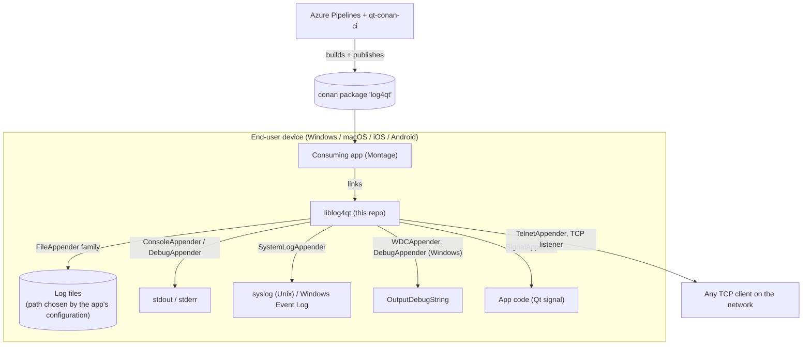
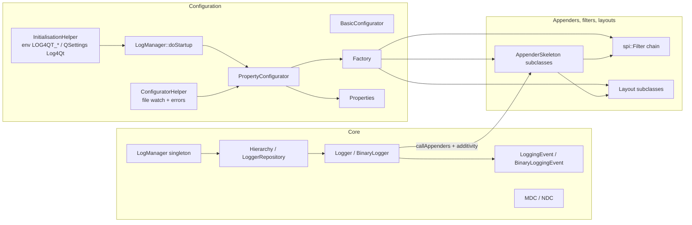

# Architecture — Log4Qt (DisplayNote fork)

Log4Qt is a single shared (or static, with `LOG4QT_STATIC`) library. It has no process, service or
UI of its own: everything runs inside the consuming application. Overview, build and conventions are
in [`../AGENTS.md`](../AGENTS.md); this file covers context, components and data flow.

## Context

## Components

## Main data flow — one log call

1. App code calls `logger()->info("…")`, an `l4qInfo(...)` macro, `LogStream`, `QmlLogger`, or
   `qDebug()` with `LogManager::setHandleQtMessages(true)` (then `LogManager::qtMessageHandler`
   turns the Qt message into a `LoggingEvent` on the `Qt` logger, `src/log4qt/logmanager.cpp`).
2. `Logger::log` checks the logger's effective level and the repository threshold, then
   `Logger::callAppenders` (`src/log4qt/logger.cpp`) calls every attached appender and, while
   additivity is `true` (the default), the parent logger's appenders up to the root.
3. `AppenderSkeleton::doAppend` (`src/log4qt/appenderskeleton.cpp`) serialises with a mutex, blocks
   recursion, checks `checkEntryConditions()`, the appender threshold and the filter chain, then
   calls `append()`.
4. `append()` formats with the layout (`PatternLayout`, `TTCCLayout`, `SimpleLayout`,
   `SimpleTimeLayout`, `XMLLayout`, `BinaryLayout`/`BinaryToTextLayout`, `DatabaseLayout`) and writes
   to the sink. `AsyncAppender` and `MainThreadAppender` re-dispatch the event to other appenders on
   a worker thread / the main thread.

## Startup

`LogManager::instance()` (first logger request) runs, in order (`src/log4qt/logmanager.cpp`):
`doConfigureLogLogger()` (internal `Log4Qt` logger → stdout ≤ INFO, stderr ≥ WARN, level from the
`Debug` setting, default `ERROR`), `welcome()`, then `doStartup()`, which searches for a
configuration — details in [modules/configuration.md](modules/configuration.md).

## Active decisions (DisplayNote)

- Qt 6.8 is the floor (`src/log4qt/log4qt.h`, `CMakeLists.txt`); deprecated Qt 5 APIs were removed
  (see `ChangeLog.md` v1.7.0).
- DisplayNote ships the qmake build only, with `QT += core xml network concurrent`: `TelnetAppender`
  is included, `DatabaseAppender` is not. Windows builds also include `WDCAppender` and
  `ColorConsoleAppender`.
- The library builds straight into the install tree (`DESTDIR = $$INSTALL_PREFIX/lib$$LIB_SUFFIX`),
  using the `PREFIX` passed by qt-conan-ci; Android libraries are suffixed with the ABI
  (`log4qt_$${QT_ARCH}`), and Android's implicit `/libs` install is disabled.
- macOS builds per architecture (x86_64 and arm64 stages), defaulting to `QMAKE_HOST.arch`.
- iOS: deployment target 14.0; environment variables are not read (`helpers/initialisationhelper.cpp`).
